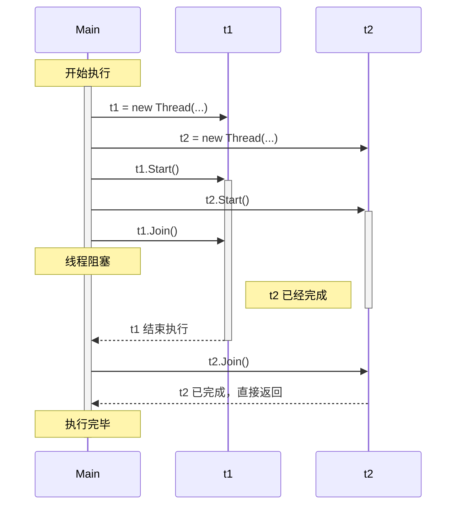
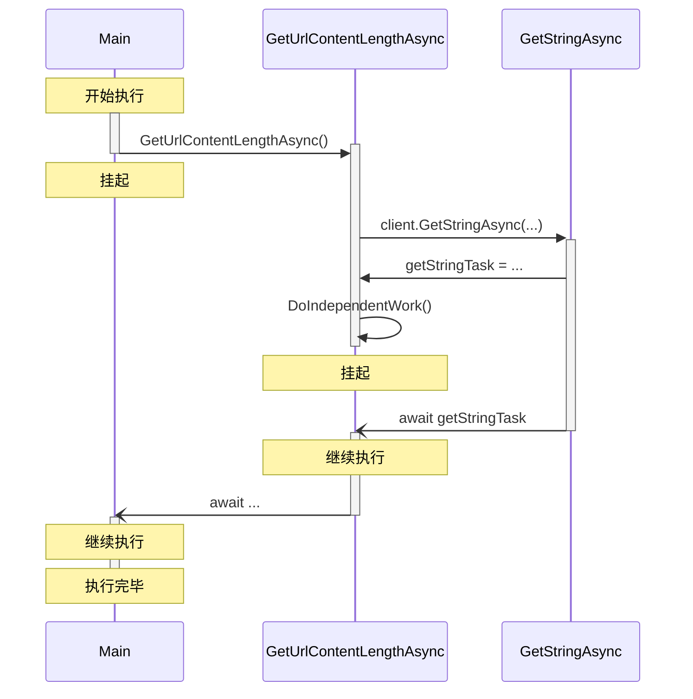

## 多线程

随着计算机程序愈发复杂，程序对计算机资源的消耗日渐增长，队列式的指令处理已不能解
决一些实际问题，我们亟需一种更高效的方式利用计算机资源，于是多线程诞生了。

现代操作系统基本都支持多进程、多线程操作。通常一个程序作为一个进程执行，一个进程
中可以按不同任务分配多个线程。

> 部分编程语言（如 Python、Kotlin）有协程（Coroutine）概念，协程是对线程的进一步
> 细分，用于在线程内部管理、协调任务。

![多线程的进程][multithreaded-process]

一个进程通常包含一个主线程，用于协调其余线程、控制用户界面等。为了避免内存泄漏等
问题，主线程一般应等待其他线程结束后才结束。

### 手动线程管理：`Thread` 类的使用

```csharp
using System.Threading;

// 声明线程
Thread t1 = new Thread(
    () =>
    {
        Thread.Sleep(Random.Shared.Next(500, 1000));
        Console.WriteLine("Hello from thread1");
    }
);

Thread t2 = new Thread(
    () =>
    {
        Thread.Sleep(Random.Shared.Next(500, 1000));
        Console.WriteLine("Hello from thread2");
    }
);

// 启动线程
t1.Start();
t2.Start();

Console.WriteLine("Working...");

// 等待线程结束
t1.Join();
t2.Join();
```

可能的输出：

```plaintext
Working...
Hello from thread2
Hello from thread1
```

（涉及多线程的程序经常会出现输出结果不一致的情况，因为线程的执行时间不一定相同，
所以程序的输出结果不一定相同。）

一个线程只能被启动一次，如果线程已经启动或终止，再次启动将会抛出异常。

程序可能执行顺序如下图：



使用手动线程管理有如下缺点：

- 在子线程执行时，主线程处于等待状态，额外消耗资源；
- 子线程中的异常不能被主线程捕获；
- 线程运算的结果不能以返回值的形式由主线程捕获；
- 大量对 `Thread` 对象的操作影响代码可读性；
- 线程死锁；
- ……

### 线程异常处理

```csharp
try
{
    throw new Exception("Exception from main thread");
}
catch (Exception e)
{
    Console.WriteLine($"Exception caught: {e.Message}");
}

Thread tProblem = new Thread(
    () =>
    {
        Thread.Sleep(Random.Shared.Next(500, 1000));
        throw new Exception("Exception from thread tProblem");
    }
);

try
{
    tProblem.Start();
    tProblem.Join();
}
catch (Exception e)
{
    Console.WriteLine($"Exception caught: {e.Message}");
}
```

可能的输出：

```plaintext
Exception caught: Exception from main thread
Unhandled exception. System.Exception: Exception from thread tProblem
   at Program.<>c.<<Main>$>b__0_0() in **.cs:line 41
   at System.Threading.Thread.StartCallback()
```

线程的错误必须在线程内部处理，否则将会导致程序崩溃。

### 线程池 `ThreadPool`

为了防止过多线程占用大量资源，我们可以使用线程池管理大量线程。线程池会自动分配线
程的执行顺序，实现 CPU 与 RAM 的资源调度。

线程池维护着程序的最大和最小线程数，并可通过 `QueueUserWorkItem` 方法将进程加入
线程池。

线程池并不提供等待任务完成的方法，需要我们手动注册 `WaitHandle`，如
`AutoResetEvent` 和 `ManualResetEvent`。

```csharp
using System.Threading;

ManualResetEvent[] done = Enumerable
    .Range(0, 20)
    .Select(_ => new ManualResetEvent(false))
    .ToArray();

foreach (int i in Enumerable.Range(0, done.Length))
{
    ThreadPool.QueueUserWorkItem(
        (d) =>
        {
            Thread.Sleep(Random.Shared.Next(500, 1000));
            Console.WriteLine("Work" + i + " in ThreadPool done.");
            d.Set();
        },
        done[i],
        false
    );
}
Console.WriteLine("Working...");
WaitHandle.WaitAll(done);
Console.WriteLine("Exiting...");
```

可能的输出：

```plaintext
Working...
Work19 in ThreadPool done.
Work10 in ThreadPool done.
Work13 in ThreadPool done.
Work3 in ThreadPool done.
Work15 in ThreadPool done.
Work0 in ThreadPool done.
Work5 in ThreadPool done.
Work8 in ThreadPool done.
Work7 in ThreadPool done.
Work16 in ThreadPool done.
Work14 in ThreadPool done.
Work11 in ThreadPool done.
Work1 in ThreadPool done.
Work4 in ThreadPool done.
Work9 in ThreadPool done.
Work18 in ThreadPool done.
Work17 in ThreadPool done.
Work12 in ThreadPool done.
Work2 in ThreadPool done.
Work6 in ThreadPool done.
Exiting...
```

## 使用 `Task` 进行异步编程

手动管理线程消耗资源，线程池管理线程不够灵活。那有没有更高效的管理并行计算、避免
阻塞的方法呢？C# 的异步编程技术可以解决这个问题。

确切地说，异步编程的模式多种多样，仅 C# 支持的就有以下三种：

- 基于任务的异步编程模式（TAP）；
- 基于事件的异步编程模式（EAP）；
- 异步编程模型（APM）。

其中最为简单的是基于任务的异步编程模式，这一编程模式也是目前业内最推荐的编程模
式，并被包括 JavaScript、Python、Rust 在内的其他语言学习、采用。

本节课我们主要介绍基于任务的异步编程模式，今后提到异步编程，若不额外介绍，均表示
基于任务的异步编程模式。

### `Task` 与 `Task<TResult>`

`Task` 是 C# 中对任务的抽象，它表示一个可在将来正常完成或异常终止的异步操作。

`Task<TResult>` 是 `Task` 的泛型版本，它表示一个可返回一个值的任务。在这个层面
上，`Task` 可以（不规范地）看作 `Task<void>`。

> 在其他编程语言中，`Task` 可能有不同的名称，如 `Promise`、`Future`、`defer`
> 等，在使用前应查阅对应语言的文档。

等待 `Task` 完成或获取 `Task<TResult>` 执行结果的关键字是 `await`，该关键字只能
在异步上下文中使用。异步上下文主要指使用 `async` 关键字修饰的方法、lambda 表达
式、匿名委托。

由 `async` 标注的方法，其返回值必为以下列出的类型之一：

- `Task`
- `Task<TResult>`
- `void`（不推荐）
- （C# 7.0 之后）具有 `GetAwaiter()` 方法的类型（如 `ValueTask<TResult>`）
- （C# 8.0 之后）实现了 `IAsyncEnumerable<T>` 接口的类型

除非必要，否则不建议使用 `void` 返回值，因为它可能会导致异常无法被正常捕获，或使
调用方无法得知方法执行状态。一般只有当进行桌面开发，编写事件处理程序时才考虑使
用。

表示异步操作的方法命名时应以 `Async` 结尾，如 `GetDataAsync`。

### 使用异步 I/O 方法执行 I/O 绑定工作

I/O 绑定工作指需要从 I/O 操作中获取结果的操作，如：网络请求、磁盘读写等。因为
I/O 操作响应时间通常比程序代码的执行慢，如果持续等待可能导致程序长时间阻塞、假
死，所以应该尽可能使用异步方式执行这部分代码。

I/O 绑定工作通常使用系统提供的异步 I/O 方法执行。系统中绝大多数 I/O 操作方法都提
供了异步的版本，如
`File.ReadAllTextAsync`、`HttpClient.GetStringAsync`、`DbContext.SaveChangesAsync`
等。当这些异步方法存在时，我们通常应当尽量使用这些异步方法进行 I/O 操作。

```csharp
using System.Net.Http;

Console.WriteLine(await GetUrlContentLengthAsync());

async Task<int> GetUrlContentLengthAsync()
{
    var client = new HttpClient();

    Task<string> getStringTask = client.GetStringAsync("https://docs.microsoft.com/dotnet");

    DoIndependentWork();

    string contents = await getStringTask; // .ConfigureAwait(false);
    return contents.Length;
}

void DoIndependentWork()
{
    Console.WriteLine("Working...");
}
```

可能的输出：

```plaintext
Working...
78705
```

这段代码的执行流程如下图所示：

![异步方法执行流程][async-programming-with-task]



### 使用 `Task.Run` 执行 CPU 绑定工作

与 I/O 绑定工作不同，CPU 绑定工作指需要使用 CPU 进行大量计算的工作，如数学运算、
方案规划等等。这些工作一般没有对应的异步操作方法，只有一系列同步操作。

我们可以使用 `Task.Run` 方法将一系列同步操作“打包”成一个 `Task` 对象，并在后台执
行。

`Task.Run` 是一个泛型方法，最常用的方式是将一个包含同步操作的 lambda 表达式传递
给它，让该同步操作异步执行。

```csharp
using System.Threading;

Console.WriteLine("Synchronous:");
Dish d1 = Canteen.Order("Kung Pao Chicken");
Console.WriteLine();

Console.WriteLine("Asynchronous:");
Task<Dish> d2 = Canteen.OrderAsync("Mapo Tofu");
Task<Dish> d3 = Canteen.OrderAsync("Yuxiang Shredded Pork");

await Task.WhenAll(d2, d3); // 保证所有任务完成

class Dish
{
    private string _dishName;

    public Dish(string dishName)
    {
        _dishName = dishName;
    }
}

class Canteen
{
    private static Dish Cook(string dishName)
    {
        Console.WriteLine("Cooking " + dishName);

        // 模拟耗时操作，实际等待应使用 Task.Delay
        Thread.Sleep(Random.Shared.Next(500, 1000));

        Console.WriteLine($"Finished cooking {dishName}");
        return new Dish(dishName);
    }

    public static Dish Order(string dishName)
    {
        Dish dish = Cook(dishName);
        Console.WriteLine($"Here is your {dishName}!");
        return dish;
    }

    public static async Task<Dish> OrderAsync(string dishName)
    {
        Dish dish = await Task.Run(() => Cook(dishName));
        Console.WriteLine($"Here is your {dishName}!");
        return dish;
    }
}
```

可能的输出：

```plaintext
Synchronous:
Cooking Kung Pao Chicken
Finished cooking Kung Pao Chicken
Here is your Kung Pao Chicken!

Asynchronous:
Cooking Mapo Tofu
Cooking Yuxiang Shredded Pork
Finished cooking Yuxiang Shredded Pork
Here is your Yuxiang Shredded Pork!
Finished cooking Mapo Tofu
Here is your Mapo Tofu!
```

### 异步 Lambda 表达式

C# 允许使用异步 Lambda 表达式，这些表达式使用 `async` 修饰，

异步 Lambda 表达式可以在方法体中使用 `await` 关键字等待其他异步方法完成。

异步 Lambda 表达式类型为 `Action<TParameters...>`、`Func<TParameters..., Task>`
或 `Func<TParameters..., Task<TResult>>`，而不是一般 Lambda 表达式的
`Func<TParameters..., TResult>`。

正如异步方法应避免使用 `void` 返回值，为了正确处理异步 Lambda 表达式的结果，应避
免接收方直接接收 `Action` 类型的异步 Lambda 表达式。

以下代码可以从 .NET 已注册服务中的博文列表生成 `Dictionary` 类型：

```csharp
builder.Services.AddScoped(
    async sp =>
    {
        // 从注册的服务中获取博文列表
        IList<PostInfo> list = await (sp.GetService<Task<IList<PostInfo>>>()!);
        // 将博文列表转换为 Dictionary 类型
        return list.ToDictionary(p => p.UrlTitle);
    }
);
```

### `CancellationToken` 的使用

Web 服务器可能收到大量请求，如果某个请求超时，那么可能会发生连锁反应，导致服务器
崩溃。另外对于用户已经取消的请求，我们通常也不需要继续处理。

同步操作一经启动就难以取消，但异步操作可以通过 `CancellationToken` 取消。

`CancellationToken` 一般不直接初始化，而是使用 `CancellationTokenSource` 创建，
并通过 `CancellationTokenSource.Token` 获取。

接受 `CancellationToken` 的方法可以有多种方法结束自身的执行：

- 使用 `token.ThrowIfCancellationRequested()` 抛出 `OperationCanceledException`
  异常，强制退出方法；
- 在循环操作中监听 `token.IsCancellationRequested` 属性，如果结果为 `true`，则退
  出循环；
- 将 `token` 传给内层嵌套的异步操作。

示例：

1. 抛出异常：

   ```csharp
   CancellationTokenSource tokenSource = new CancellationTokenSource();
   Task t = Task.Delay(1000, tokenSource.Token);
   tokenSource.CancelAfter(500);
   try
   {
       await t;
   }
   catch (Exception ex)
   {
       Console.WriteLine(ex);
   }
   ```

   输出：

   ```plaintext
   System.Threading.Tasks.TaskCanceledException: A task was canceled.
   ```

2. 循环监听

   ```csharp
   CancellationTokenSource tokenSource = new CancellationTokenSource();
   CancellationToken token = tokenSource.Token;
   token.Register(
       () =>
       {
           Console.WriteLine("Action canceled");
       }
   );

   // 自旋循环等待，可以替代 Thread.Sleep 进行等待操作
   SpinWait sw = new SpinWait();
   Task task = Task.Run(
       () =>
       {
           while (!token.IsCancellationRequested)
           {
               Console.Write("Running...\n");
               sw.SpinOnce();
           }
       },
       token
   );
   tokenSource.CancelAfter(10);
   await task;
   ```

   可能的输出：

   ```plaintext
   Running...
   Running...
   Running...
   Running...
   Running...
   Running...
   Running...
   Running...
   Running...
   Action canceled
   ```

## 总结

有关 C# 的异步与多线程操作，还有许多可以深入研究的内容。同时，异步编程也是 Web
开发中提升并发量、优化资源分配的重要手段。学习好异步编程，可以为 Web 开发打下坚
实的基础。

## 参考资料

- [多线程 - 维基百科](https://zh.wikipedia.org/zh-cn/%E5%A4%9A%E7%BA%BF%E7%A8%8B)
- [C# 中的异步编程 | Microsoft Docs](https://docs.microsoft.com/zh-cn/dotnet/csharp/programming-guide/concepts/async/)
- [C# - Async / Await Lambdas - Stack Overflow](https://stackoverflow.com/questions/25647062/async-await-lambdas)
- [The perils of async void - The Old New Thing](https://devblogs.microsoft.com/oldnewthing/20170721-00/?p=96665)

[multithreaded-process]: /image/c-sharp-multithreading-and-asynchronous-programming/multithreaded-process.svg
[async-programming-with-task]: /image/c-sharp-multithreading-and-asynchronous-programming/async-programming-with-task.png
